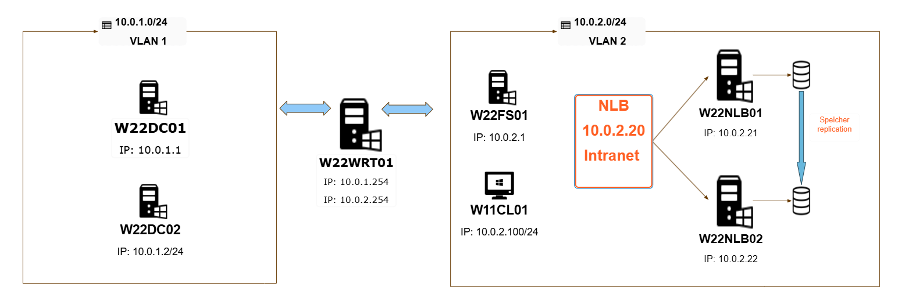
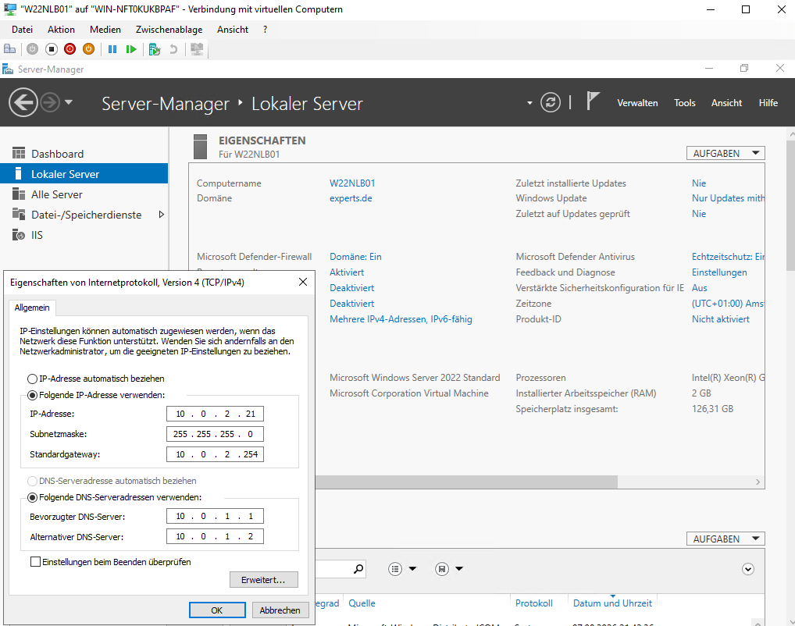

# 🖥️ Hochverfügbare Webserver-Infrastruktur mit Windows Server 2022 und NLB

## 🎯 Projektziel

Der Aufbau einer hochverfügbaren Webserver-Infrastruktur mit Windows Server 2022, IIS und Network Load Balancing (NLB) dient der Lastverteilung und Ausfallsicherheit. Ziel ist es, mehrere Webserver so zu konfigurieren, dass sie gemeinsam eine Website bereitstellen und auch bei Ausfall eines Servers weiterhin erreichbar bleiben.

---

## 🧩 Netzwerkdesign

### VLAN-Struktur

| VLAN | Subnetz | Geräte | Beschreibung |
|------|---------|--------|-------------|
| **VLAN 1** | 10.0.1.0/24 | W22FS01, W22DC01, W22WRT01 | Verwaltung, DNS und Routerzugriff |
| **VLAN 2** | 10.0.2.0/24 | W22WEB01 (10.0.2.21), W22WEB02 (10.0.2.22), NLB-Cluster-IP 10.0.2.20 | Webserver-Cluster für Lastverteilung |

### Netzwerkschema

> Diagramm im Ordner [docs](docs/) speichern und anschließend hier einbinden.



---

## ⚙️ Installations- und Konfigurationsschritte

### 1. Serverinstallation in VLAN 2

Installiere zwei Windows Server 2022 Instanzen:

- W22WEB01
- W22WEB02

### 2. IIS-Rolle hinzufügen

Öffne den Server-Manager und aktiviere unter Rollen und Features die Rolle **Webserver (IIS)**.

### 3. Testseiten erstellen

Gehe in das Verzeichnis `C:\inetpub\wwwroot\iisstart` und bearbeite `index.html` oder `iisstart.htm`.

Beispielinhalt:

- Server 1: „Willkommen auf W22WEB01“
- Server 2: „Willkommen auf W22WEB02“

### 4. Test im Browser (Client W22FS01)

Rufe im Browser die folgenden Adressen auf:

- http://10.0.2.21
- http://10.0.2.22

Du solltest unterschiedliche Texte auf den beiden Servern sehen.

### 5. Feature „Netzwerklastenausgleich“ installieren

Auf beiden Webservern:

- Server-Manager → Features → **Network Load Balancing** aktivieren

### 6. Cluster erstellen (W22NLB01)

In den Tools:

- **Netzwerklastenausgleich-Manager** öffnen
- Neues Cluster anlegen
- Hosts hinzufügen: W22WEB01, W22WEB02
- Cluster-IP: `10.0.2.20`
- Modus: **Multicast**
- Einrichtung abschließen

### 7. DNS-Eintrag hinzufügen (W22DC01)

Im DNS-Manager:

- Zone `experts.de` öffnen
- Neuer Host (A) anlegen
- Name: `intranet`
- IP: `10.0.2.20`

Test über den Browser:

- http://intranet

Die Seite sollte abwechselnd von Server 1 oder Server 2 ausgeliefert werden.

### 8. Failover-Test

Schalte W22WEB01 aus und aktualisiere die Seite im Browser. Die Website sollte weiterhin über W22WEB02 verfügbar sein.

Damit ist die Cluster-Redundanz erfolgreich bestätigt.

---

## 📸 Dokumentation & Screenshots

Die Screenshots werden im Ordner [images](images/) gespeichert.

- [IIS Server 1](images/iis_server1.png)
- [IIS Server 2](images/iis_server2.png)
- [NLB Manager](images/nlb_manager.png)
- [DNS Eintrag](images/dns_entry.png)

Beispiel für die Einbindung in die README:




---

## 🧠 Ergebnis

- Cluster-IP: `10.0.2.20`
- Lastverteilung: Round-Robin zwischen W22WEB01 und W22WEB02
- Ausfallsicherheit: Bei Ausfall eines Servers übernimmt der andere automatisch
- DNS-Alias: `intranet.experts.de` zeigt auf die Cluster-IP

---

## 📁 Projektstruktur

```text
NLB-Projekt/
├── README.md
├── docs/
│   └── nlb_network_diagram.png
├── images/
│   ├── iis_server1.png
│   ├── iis_server2.png
│   ├── nlb_manager.png
│   └── dns_entry.png
└── scripts/
    └── setup_notes.txt
```

---

## 🏁 Fazit

Das Projekt demonstriert den Aufbau einer redundanten und skalierbaren Webserver-Infrastruktur mit Windows Server 2022, IIS und NLB. Durch die Kombination aus DNS, VLAN-Trennung und Cluster-IP entsteht eine stabile Umgebung, die sowohl Lastverteilung als auch Ausfallsicherheit gewährleistet.
